# 自动化生成 PDF 简历流水线

一个基于 LaTeX + YAML + GitHub Actions 的自动化简历生成系统。只需修改 YAML 数据文件，即可一键生成保持既有版式的 PDF 简历。

## 🎯 项目特点

- **数据与排版分离**：只需编辑 YAML 文件，无需接触复杂的 LaTeX 代码
- **持续集成**：推送到 GitHub 后自动编译生成 PDF
- **版本控制**：Git 管理，支持多人协作
- **云端编译**：无需本地安装 LaTeX 环境

## 🚀 快速开始

### 本地开发（可选）

1. **安装依赖**
   ```bash
   pip install -r requirements.txt
   ```

2. **编辑简历数据**
   ```bash
   vim data.yaml  # 修改个人信息
   ```

3. **生成 LaTeX 文件**
   ```bash
   python3 render.py  # 生成 resume.tex
   ```

4. **编译 PDF（需要 LaTeX 环境）**
   ```bash
   make pdf  # 或者 latexmk -pdf resume.tex
   ```

### 云端自动编译（推荐）

1. **Fork 本仓库**
2. **修改 `data.yaml` 文件**
3. **提交并推送**
   ```bash
   git add data.yaml
   git commit -m "update resume data"
   git push
   ```
4. **下载生成的 PDF**
   - 访问 GitHub Actions 页面
   - 找到最新的构建记录
   - 下载 Artifacts 中的 `resume-pdf`

## 📁 项目结构

```
resume-pipeline/
├── data.yaml                    # 📝 简历数据（主要编辑文件）
├── template.tex                 # 🎨 LaTeX 模板
├── render.py                    # 🔄 渲染脚本
├── requirements.txt             # 📦 Python 依赖
├── Makefile                     # 🛠️ 本地构建工具
├── .github/workflows/build.yml  # ⚙️ GitHub Actions 配置
└── README.md                    # 📖 项目说明
```

## 📝 编辑简历

主要编辑 `data.yaml` 文件：

```yaml
name: 你的姓名
email: your.email@example.com
phone: 123-456-7890
location: 城市, 国家

work:
  - company: 公司名称
    position: 职位
    start: 2024-01
    end: Present
    bullets:
      - 工作成就1
      - 工作成就2

education:
  - institution: 学校名称
    degree: 学位
    start: 2020-09
    end: 2024-06

skills:
  - category: 编程语言
    technologies: ["Python", "JavaScript", "Go"]
```

## 🔧 自定义模板

如需修改版式，编辑 `template.tex`：
- 使用 Jinja2 语法：`{{ variable }}`, ``
- 保持 LaTeX 语法正确性
- 避免使用 `items` 作为字段名（与 Python dict 方法冲突）

## 🐛 常见问题

### 渲染失败
- **检查 YAML 语法**：确保缩进和格式正确
- **避免特殊字符**：LaTeX 中的 `&`, `%`, `$` 等需要转义

### GitHub Actions 失败
- **检查文件名**：确保 `data.yaml` 和 `template.tex` 存在
- **查看日志**：在 Actions 页面查看详细错误信息

### 本地编译失败
- **安装 LaTeX**：
  - macOS: `brew install --cask mactex`
  - Ubuntu: `sudo apt-get install texlive-full`
  - Windows: 下载 MiKTeX

## 📊 工作流程

```mermaid
graph LR
    A[编辑 data.yaml] --> B[git push]
    B --> C[GitHub Actions]
    C --> D[python render.py]
    D --> E[latexmk -pdf]
    E --> F[生成 resume.pdf]
    F --> G[下载 Artifacts]
```



## 🤝 贡献

欢迎提交 Issue 和 Pull Request！

## �� 许可证

MIT License 